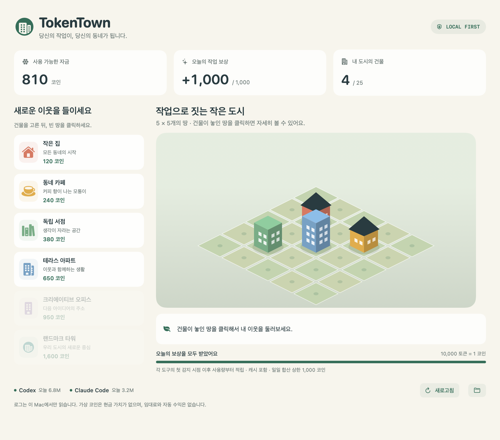

# TokenTown

Codex와 Claude Code로 작업하면서 가상 건물을 구매하고 배치하는 macOS 도시 게임입니다.
독립 저장소로 개발하며, PokeTokenBar의 로컬 로그 파서와 증분 캐시를 재사용합니다.



## 실행

macOS 14 이상, Swift 6 이상이 필요합니다. 현재 빌드는 실행한 Mac의 아키텍처를 대상으로 합니다.

```bash
./scripts/build-town.sh
open build/TokenTown.app
```

빌드 결과는 `build/TokenTown.app`에 저장됩니다. Finder에서 응용 프로그램 폴더로 복사해도 됩니다. 로컬 ad-hoc 서명 빌드이며 공증한 공개 배포본은 아닙니다. 원본 PokeTokenBar 앱을 설치하거나 교체하지 않습니다.

개발 중에는 `swift run`으로 실행할 수 있습니다. 테스트는 `swift test`로 실행합니다.

## 플레이

1. 시작 자금은 200 코인입니다. 왼쪽 목록에서 120 코인짜리 작은 집을 선택합니다.
2. 도시의 빈 땅을 클릭하면 자금을 차감하고 건물을 배치합니다. 건물을 선택하는 단계에서는 돈을 쓰지 않습니다.
3. Codex 또는 Claude Code에서 작업합니다. 60초마다 사용량을 읽으며 새로고침 버튼으로 즉시 확인할 수 있습니다.
4. 도구별 첫 감지 시점의 오늘 사용량을 기준선으로 저장합니다. 그 이후 사용량 10,000 토큰마다 1 코인을 적립합니다. 입출력과 캐시 토큰을 포함합니다.
5. 두 도구의 보상은 하루 합산 최대 1,000 코인입니다. 1 코인 미만의 사용량은 해당 날짜 안에서 누적합니다. 자정에는 새 보상 일자가 시작됩니다.
6. 건물이 놓인 땅을 선택하고 `건물 이동`을 누른 뒤 빈 땅을 선택하면 무료로 이사합니다.
7. 창 크기는 고정이며, 화면 높이가 낮으면 세로로 스크롤합니다. 창을 닫거나 `⌘Q`로 **메뉴 막대에서 계속 실행**을 선택하면 Dock에서 사라지고 60초마다 사용량을 계속 읽습니다. 메뉴 막대의 **내 도시 열기**로 돌아올 수 있습니다. **TokenTown 완전히 종료**(`⌥⌘Q`)를 선택하면 감시도 중단됩니다. 강제 종료·로그아웃·재부팅 후 자동 실행은 지원하지 않습니다.

6종 건물과 지구당 25개 필지를 제공합니다. 코인은 가상 게임 자금이며 현금으로 환전할 수 없습니다.

## 도시 성장

- **첫 목표 — 이웃 거리**: 같은 지구에서 작은 집과 카페를 상하좌우의 옆 땅에 배치한 뒤 **거리 완성하기**를 누르세요. 대각선은 이웃으로 계산하지 않습니다. 목표 보상 200 코인은 한 번만 지급하며 작업 보상 및 일일 상한과 별도로 기록합니다. 거리·주민·가로등이 나타납니다. 집이나 카페를 옮겨 조합이 끊기면 거리 표현은 사라지지만 달성 기록과 보상은 유지됩니다.
- **두 번째 지구**: 목표 완성 후 **새 지구 선택**에서 숲속 또는 강변을 선택합니다. 25개의 땅이 무료로 추가되어 전체 50개가 됩니다. 선택은 저장되며 변경할 수 없습니다. 상단 지구 버튼으로 오갑니다. 첫 버전은 두 지구까지 지원합니다.
- **건물 성장**: 건물을 선택한 뒤 **성장**을 누르면 Lv.2는 120 코인, Lv.3은 240 코인으로 높이와 단계 표식이 바뀝니다. 최고 단계는 Lv.3입니다.
- **장식**: 건물별 50 코인으로 나무와 벤치를 한 번 설치합니다. 건물을 옮겨도 성장 단계와 장식은 따라갑니다.
- **살아 있는 거리**: 조합이 유지된 곳에서 주민이 왕복하며 **밤으로**를 누르면 창과 가로등에 불이 켜집니다. macOS의 동작 줄이기 설정에서는 주민 이동과 전환 애니메이션을 멈춥니다. 낮·밤은 미리보기 선택이며 보상이나 실제 시간에 영향을 주지 않습니다.

임대료·자동 수익·매각·재개발·온라인 계정·클라우드 동기화는 포함하지 않습니다. 작업하지 않은 날에 도시가 쇠퇴하지 않습니다.

## 설정과 도구 연동

`Cmd + ,` 또는 TokenTown 메뉴의 **설정…**으로 연동 화면을 엽니다. Codex와 Claude Code의 기본 로그 경로는 자동으로 탐색합니다. 별도 경로를 사용한다면 **폴더 추가…**로 실제 `sessions` 또는 `projects` 폴더를 추가하고 **저장 및 연동 확인**을 누르세요. 숨김 폴더도 선택할 수 있습니다. 입력을 비워 저장하면 기본 자동 탐색만 사용합니다.

설정은 이 Mac에 저장됩니다. API 키나 OAuth 로그인 없이 로컬 로그만 읽으며, `로그 대기 중`이면 해당 도구로 작업한 뒤 다시 확인하세요. 추가 경로에서 과거 로그가 발견되면 이미 연동한 도구의 기존 일별 최고값을 기준으로 보상을 계산합니다.

## 로그와 개인정보

Codex의 로컬 JSONL 세션 로그와 Claude Code의 로컬 프로젝트 로그를 읽습니다. 기본 경로는 `~/.codex/sessions`와 `~/.claude/projects`이며, 원본 파서가 지원하는 대체 경로도 따릅니다. 프롬프트를 서버로 전송하거나 모델 호출을 실행하지 않습니다. 사용량 한도 인증이나 업데이트 확인을 위해 네트워크를 호출하지 않습니다.

첫 실행은 기존 사용량을 보상하지 않습니다. 앱을 꺼 둔 기간의 기록은 최초 감지 일자 이후 로그가 디스크에 남아 있는 경우 다시 읽어 적립합니다. 일별 최고 사용량을 저장하기 때문에 반복 새로고침·재시작·로그 감소 후 복원은 이중 보상을 만들지 않습니다. 일별 총량을 기준으로 하므로 로그를 삭제해 총량이 줄면, 기존 최고값을 넘을 때까지 신규 보상도 발생하지 않을 수 있습니다. 로컬 파일 수정으로 치팅을 완전히 막는 시스템은 아닙니다.

원본 파서는 일부 파일 읽기 실패를 빈 결과로 반환할 수 있습니다. `로그 대기 중`은 사용량이 정확히 0이라는 보장이 아닙니다. 로그가 없으면 별도 권한 요청 없이 대기하며, 실제 기록이 감지되기 전에는 기준선을 확정하지 않습니다.

## 저장과 복구

기본 저장 위치:

```text
~/Library/Application Support/TokenTown/
  city.json             현재 도시·자금·일별 보상 원장
  city.backup.json      직전 정상 저장본
  city.lock             동시 실행 방지용 잠금 파일
  usage-cache/          원본 파서의 증분 캐시
```

저장 버전 1의 도시는 잔액·건물·작업 보상 기준선을 보존하여 버전 2로 읽습니다. 다음 거래가 성공할 때 새 형식으로 저장하고 직전 원본은 백업으로 보존합니다. 기존 6종 건물의 과거 가격은 마이그레이션에 고정되어 있으며, 새 거래는 실제 구매·성장·장식 비용을 저장합니다. 기존 도시에 목표 보상을 자동 지급하거나 지구를 자동 선택하지 않습니다.

구매·이동·적립·목표 보상·확장·성장·장식은 파일에 원자적으로 저장된 뒤 화면에 반영합니다. 저장 실패 시 거래를 취소합니다. 손상된 저장 파일은 덮어쓰지 않고 읽기 전용으로 엽니다. 화면의 백업 복구 버튼으로 직전 저장본을 복구할 수 있으며, 손상된 원본은 별도 파일로 보존합니다. 복구 시 최근 거래 일부가 되돌아갈 수 있습니다. 미래 버전 저장 파일은 이전 버전으로 자동 변환하지 않습니다.

개발·QA에서 실제 도시와 분리하려면 다음처럼 실행합니다.

```bash
TOKENTOWN_STATE_DIR=/tmp/my-test-town swift run
```

미리보기 이미지는 실제 화면을 샘플 데이터로 렌더링하며, 사용자 로그나 도시를 읽거나 수정하지 않습니다.

```bash
swift run TokenTown --render-city-preview /tmp/tokentown-preview.png
```

## Acknowledgments and license

TokenTown is built upon [PokeTokenBar by chattymin](https://github.com/chattymin/PokeTokenBar), with a new city-building game experience. It is an independent project, not an official successor.

원본 저작권 고지와 MIT 전문은 [LICENSE](LICENSE)에 유지합니다. 재사용 범위는 [THIRD_PARTY_NOTICES.md](THIRD_PARTY_NOTICES.md)에 기록합니다. 포켓몬 코드와 에셋은 포함하지 않으며, 도시 화면·건물·아이콘은 TokenTown의 자체 벡터 그래픽입니다.
